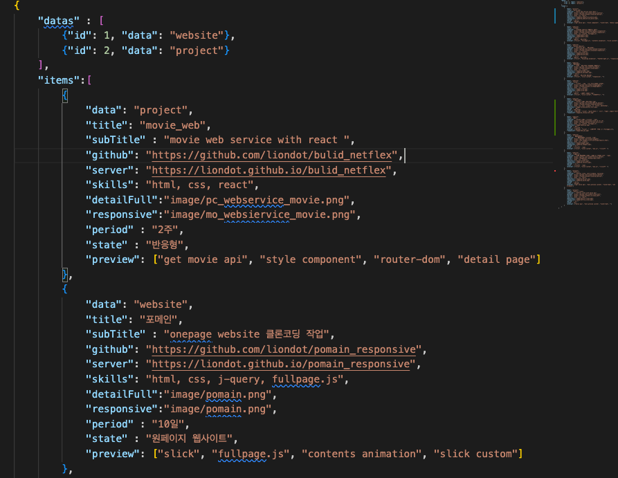
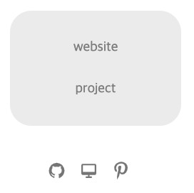
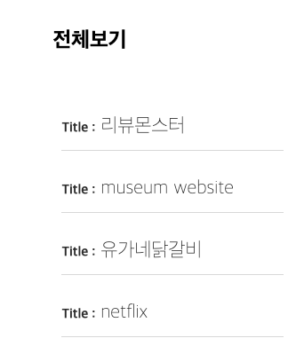
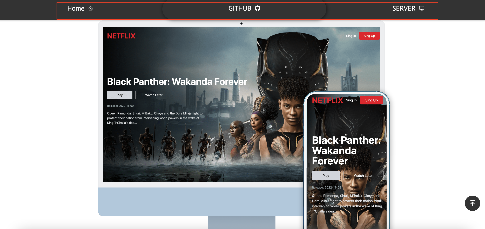
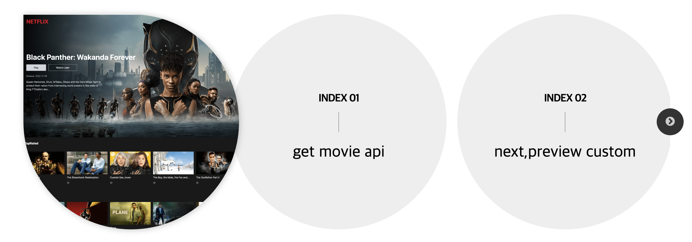
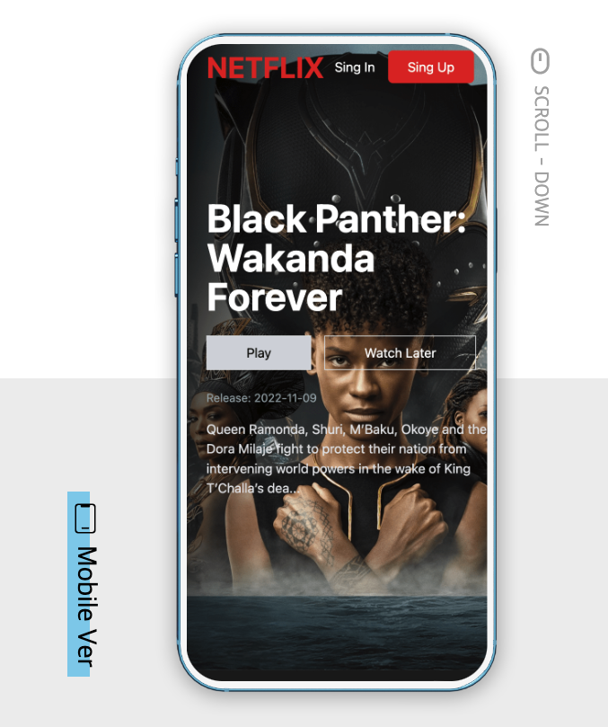
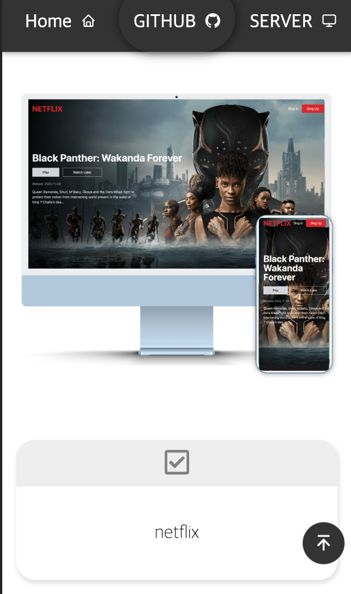

# 리엑트로 제작한 프로젝트 입니다. [Link](https://liondot.github.io/projects)

## - 목적 
```
프로젝트를 한 눈에 보기 쉽게 리액트로 제작.
```

<br/>

## - steck 
     


<br/>

## - install  
```
react-icon, swiper, sass, wow
```

___
<br/>

### - 기능 구현 정의

1. 데이터를 받아와 Ui로 출력하기 위해 json dummy 파일을 만들고 그 안에 작업한 내용을 배열과 객체 프로퍼티로 생성하였습니다.
data로 분류한 카테고리 링크를 클릭 시 해당 영역이 나뉘어 출력됩니다.


  

___ 
<br/>

2. data클릭 시 router-dom로 해당 서브 페이지 유입

 
<br/><br/>

___

<br/>

3. Quick menu 인 메인으로 넘어가기, github, server 버튼을 윈도우가 최상단일 경우와 
스크롤을 통해 Top 값이 변경될 때 의 ui를 논리 연산자를 통해 상태에 따라 다르게 보여주었습니다. 
이는 사용자의 컨텐츠 소비 를 더욱 효율적으로 보여주기 위해 작업되었습니다.

  
<br/><br/>

___
<br/>

 4. 기능 구현 섹션에 슬라이드는 해당 객체에 key인 preview의 배열을 통해 
    어떤 기능이 구현되었는지 순차적으로 값이 보여집니다. 
   배열의 Index 값이 기본값인 index.length = 4 보다 작은 경우 빈 도형으로 출력됩니다. 

 
<br/><br/>

___
<br/>

 5. Desktop, mobile을 simulation으로 체험할 수 있는 ui scroll down 영역입니다.

     

     <br/><br/>
 ___
 <br/>

 6. 반응형으로 제작하여 모바일에서 사이트를 확인 할 수 있게 제작되었습니다.



___

<br/><br/>
### - 개선해야 할 점
데이터를 불러올 때 로딩시간이 오래 걸려 사용자가 답답함을 느낄 수 있다. 
이점에 성능개선이 필요

- 이미지 용량 때문인지 확인
- 리랜더링 할 때 컴포넌트 개수 때문에 영향을 받는지 확인
- 개발자 도구에서 profiler 성능 측정 필요


23.03.20일
